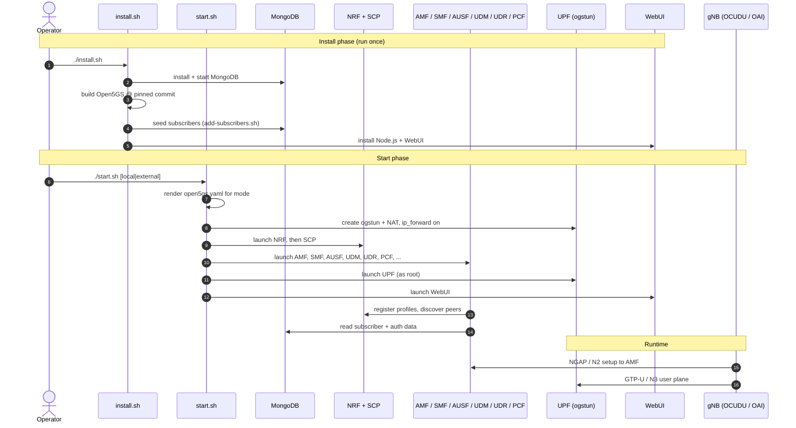
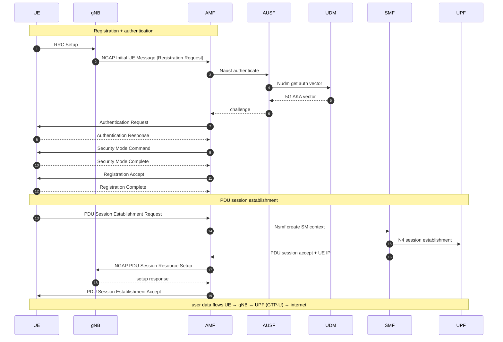

# Open5GS Core — portable install & control kit

A small, self-contained set of scripts to install, run, and tear down an
[Open5GS](https://github.com/open5gs/open5gs) 4G/5G core on Ubuntu — built from
source, seeded with test subscribers, and ready for either an all-in-one
(loopback) setup or an **external gNB** over the physical network.

It is location-independent (everything resolves relative to the repo), reads all
of its settings from a single `open5gs.env`, and asks for `sudo` interactively
instead of storing a password.

---

## What's in here

```
open5gs-core/
├── open5gs.env                 # the only file you normally edit
├── install.sh                  # build deps, MongoDB, Open5GS, WebUI, seed subscribers
├── start.sh                    # render config, set up ogstun/NAT, launch the NFs
├── stop.sh                     # stop everything and undo host changes
├── restart.sh                  # stop + start
├── add-subscribers.sh          # counter-based subscriber provisioning
├── lib/
│   └── common.sh               # shared logging / sudo / network / render helpers
└── templates/
    └── open5gs.yaml.template   # one template for both local and external modes
```

---

## Prerequisites

- Ubuntu (20.04 / 22.04 / 24.04), with a user that can `sudo`.
- Outbound internet access for the package, MongoDB, and source downloads.

---

## Quick start

```bash
chmod +x *.sh
./install.sh                 # one-time: build everything and seed subscribers
./start.sh                   # local mode (all NFs on loopback)
#   ./start.sh external      # bind radio-facing NFs to the physical IP for a real gNB
#   ./start.sh external 2-7  # ...and pin the NF processes to CPUs 2–7
```

Then point your gNB's AMF/N2 address at this host (in external mode, at
`NODE_IP`), and open the WebUI at `http://<host>:9999` (default `admin` / `1423`).

Stop and clean up with `./stop.sh`.

---

## How the system works

The first diagram shows the lifecycle: what `install.sh` and `start.sh` set up,
and how the running pieces talk to each other once a gNB attaches.



## Message flow (5G SA registration + PDU session)

The second diagram is the on-air message sequence when a UE registers and opens a
data session — the path that has to succeed end to end for the UE to get an IP
and pass traffic.



---

## Configuration (`open5gs.env`)

| Variable | Default | Meaning |
|---|---|---|
| `MODE` | `local` | `local` = loopback binds; `external` = physical-IP binds for a remote gNB |
| `MCC` / `MNC` / `TAC` | `001` / `01` / `1` | PLMN and tracking area — must match the gNB |
| `SST` / `DNN` | `1` / `internet` | default slice and data network name |
| `UE_SUBNET` / `UE_GW` | `10.45.0.0/16` / `10.45.0.1` | UE address pool and `ogstun` gateway |
| `DNS1` / `DNS2` | `8.8.8.8` / `8.8.4.4` | DNS handed to UEs |
| `INF` / `NODE_IP` | auto | NIC and IP; auto-detected from the default route if blank |
| `VNF_VI_IP` | auto | gNB-link virtual IP in external mode; defaults to `NODE_IP` + 1 |
| `WEBUI_PORT` | `9999` | WebUI port |
| `OPEN5GS_GIT_REF` | pinned | Open5GS commit to build |
| `MONGODB_VERSION` / `NODE_VERSION` | `8.0` / `16.20.2` | toolchain pins |
| `SIM_K` / `SIM_OPC` / `SIM_AMF` | test vectors | **public** Open5GS/srsRAN test SIM values |
| `SUB_IMSI_BASE` / `SUB_COUNT` | `001010000000001` / `10` | starting IMSI and how many to seed |
| `SUB_PDU_TYPE` | `3` | `1`=IPv4, `2`=IPv6, `3`=IPv4v6 |

---

## Managing subscribers

Instead of editing a long `insertMany([...])` by hand, provisioning is a counter:
give it a starting IMSI and a count.

```bash
./add-subscribers.sh seed                 # add SUB_COUNT IMSIs from SUB_IMSI_BASE
./add-subscribers.sh range 001010000000001 50   # add 50 consecutive IMSIs
./add-subscribers.sh add 001010000000099  # add a single IMSI
./add-subscribers.sh list                 # list provisioned IMSIs
./add-subscribers.sh remove 001010000000099
./add-subscribers.sh reset                # wipe all subscribers (asks first)
```

Every generated profile shares the `SIM_K` / `SIM_OPC` / `SIM_AMF` and the slice
defaults from `open5gs.env`. Adds are idempotent — re-running skips IMSIs that
already exist — and take effect immediately without restarting any daemon. For
SIM-specific keys, either set `SIM_*` in the env or use the WebUI.

---

## Operating it

```bash
screen -ls                 # list running NF sessions
screen -r amf              # attach to a NF log  (Ctrl-A then D to detach)
screen -d -r smf
sudo screen -r upf         # the UPF runs as root, so attach with sudo
```

Per-NF logs are also written to `open5gs_logs/<nf>.log`.

### local vs external

- **local** — every function binds to `127.0.0.x`. Use this when the gNB/UE
  (or an RF/UE simulator) runs on the same machine.
- **external** — AMF (N2/NGAP), UPF (N3/GTP-U), and the 4G MME/SGW-U bind to the
  host's physical IP, and a virtual IP is added to the NIC so a separate gNB has
  a stable target. The WebUI also listens on `0.0.0.0`.

---

## Security notes

- **Change the WebUI password.** The default `admin` / `1423` is created
  automatically and is well known. Change it in the WebUI's Account menu after
  the first login.
- **The `SIM_*` values are public test vectors**, not secrets — fine for a lab,
  but replace them for any real SIM/OTA use.
- **External mode exposes the core** (NGAP, GTP-U, WebUI) on the physical
  network. Keep it on a trusted lab segment or firewall it.

---

## Troubleshooting

- **No NIC / wrong NIC detected** — set `INF` and `NODE_IP` explicitly in
  `open5gs.env`.
- **A NF won't stay up** — check `open5gs_logs/<nf>.log`; the usual cause is a
  PLMN/slice mismatch with the gNB or a stale `ogstun` (re-run `./stop.sh`).
- **gNB can't reach the AMF in external mode** — confirm the gNB targets
  `NODE_IP`, and that NGAP (SCTP/38412) and GTP-U (UDP/2152) aren't firewalled.
- **WebUI login fails on a fresh DB** — start the WebUI once so it can create the
  default account, then log in.
